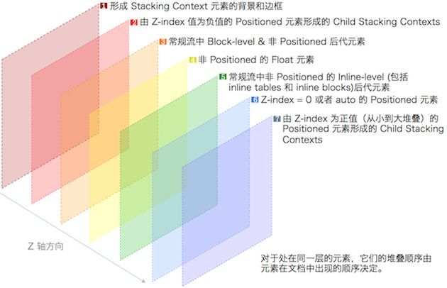
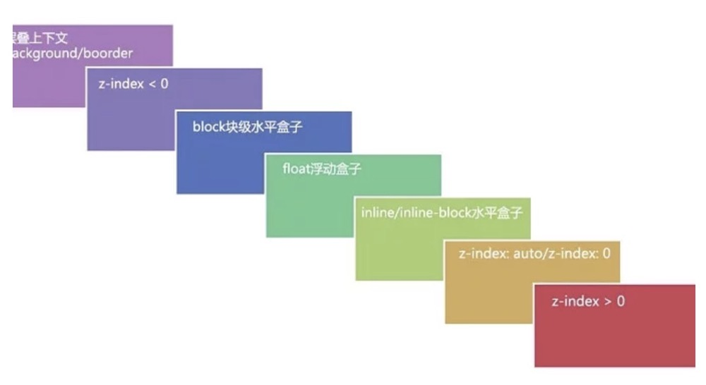

<font color="ff6666"></font>
# 层叠上下文

```
参考： 
https://developer.mozilla.org/zh-CN/docs/Web/CSS/z-index
https://www.cnblogs.com/leftJS/p/11063683.html
https://juejin.im/post/5b876f86518825431079ddd6
```
 <font color="abcdef">耐心看完吧</font>

## 4个基础概念
在CSS2.1规范中，每个盒模型的位置是三维的，分别是平面画布上的x轴，y轴以及表示层叠的z轴。
层叠上下文即元素在某个层级上z轴方向的排列关系。

4个基础概念要搞清楚，彼此不可划等号。

<font color="ff6666">

- 层叠上下文 (堆叠上下文, Stacking Context)

- 层叠等级 (层叠水平, Stacking Level)

- 层叠顺序 (层叠次序, 堆叠顺序, Stacking Order)

- z-index。

</font>


## 1  层叠上下文
### 1-1 形成层叠上下文的方法有：

#### 3种方法：

- HTML中的根元素<html></html>本身j就具有层叠上下文，称为「根层叠上下文」。

- **设置position(非static值) && 显式设置z-index(integer：正整数、负整数、0)，产生层叠上下文。**

> 🙋 [demo](https://github.com/owensiz/Blog-Owensiz/blob/master/demo/css/stack-1.html) 调试看看，z-index设为 auto 和设为 0 的表现差别。


- CSS3中的新属性也可以产生层叠上下文。

####  具体规则如下
```
- 根元素 html
- position值为 absolute|relative，且 z-index值不为 auto
- position 值为 fixed|sticky
- z-index 值不为 auto 的flex元素，即：父元素 display:flex|inline-flex
- opacity 属性值小于 1 的元素
- transform 属性值不为 none的元素
- mix-blend-mode 属性值不为 normal 的元素
- filter、 perspective、 clip-path、 mask、 mask-image、 mask-border、 motion-path 值不为none 的元素
- perspective 值不为 none 的元素
- isolation 属性被设置为 isolate 的元素
- will-change 中指定了任意 CSS 属性，即便你没有直接指定这些属性的值
- -webkit-overflow-scrolling 属性被设置 touch的元素
```

### 1-2 层叠上下文的特点
```
- 可嵌套。层叠上下文可以包含在其他层叠上下文中，并且一起组建了一个有层级的层叠上下文
- 各自独立。每个层叠上下文完全独立于它的兄弟元素，当处理层叠时只考虑子元素，这里类似于BFC
- 自包含。每个层叠上下文是自包含的：当元素的内容发生层叠后，整个该元素将会在父级叠上下文中按顺序进行层叠
```


## 2 层叠等级

表示同一个层叠上下文中元素在z轴上的显示顺序的概念


1.  **层叠等级的比较只有在同一个层叠上下文元素中才有意义。「先描述层级（层叠上下文），再描述普通元素。两个等级，普通元素的层叠等级，层叠上下文的层叠等级。」**
  - 在普通元素中，它描述定义的是这些普通元素在Z轴上的上下顺序。
  - 在同一个层叠上下文中，层叠等级描述定义的是该层叠上下文中的元素在Z轴上的上下顺序。


2. **层叠等级并不一定由 z-index 决定，只有定位元素的层叠等级才由 z-index 决定**
  - 其他类型元素的层叠等级由层叠顺序、他们在HTML中出现的顺序、他们的父级以上元素的层叠等级一同决定，详细的规则见下面层叠顺序的介绍。

> 🙋 [demo](https://github.com/owensiz/Blog-Owensiz/blob/master/demo/css/stack-2.html) 


3. **层叠等级不等于 z-index。** 


## 3 z-index

#### 作用

```
- 对于一个已经定位的元素（即position属性值不是static的元素），z-index 属性指定：

  - 元素在当前堆叠上下文中的堆叠层级。
  - **元素是否创建一个新的本地堆叠上下文。**
```

#### 设置值： 

【 auto / integer 】它可以被设置为正整数、负整数、0、auto，如果一个定位元素没有设置 z-index，那么默认为auto；
  

- auto。 元素不会建立一个新的本地堆叠上下文。当前堆叠上下文中新生成的元素和父元素堆叠层级相同。如果一个定位元素z-index缺省，那么默认为auto。
- integer。 整型数字是生成的元素在当前堆叠上下文中的堆叠层级。**元素同时会创建一个堆叠层级为0的本地堆叠上下文。这意味着子元素的 z-indexes 不与元素外的其余元素的 z-index 进行对比。**

#### 👀注意： 
<font color="ff6666">
z-index 只适用于定位的元素，对非定位元素无效。它仅在定位元素（定义了position属性，且属性值为非static值的元素）上有效果。

元素的 z-index 值只在同一个层叠上下文中有意义。如果遇到 z-index 值设了很大，但是不起作用的话，就去看看它的父级层叠上下文是否被其他层叠上下文盖住了。

</font>

## 4 层叠顺序
<font color="ff6666">
「层叠上下文」和「层叠等级」不等于层叠顺序。

「层叠顺序」是一种规则。
</font>


著名的7阶层叠水平






### 👀注意
<font color="ff6666">

1. 左上角"层叠上下文background/border"指的是**层叠上下文元素**的背景和边框。

2. 层叠上下文元素的background/border的层叠等级小于z-index值为负整数的元素的层叠等级。

> 🙋 [demo](https://github.com/owensiz/Blog-Owensiz/blob/master/demo/css/stack-3.html) 
3. inline/inline-block元素的层叠顺序要高于block(块级)/float(浮动)元素。

4. 单纯考虑层叠顺序，z-index: auto和z-index: 0在同一层级，但这两个属性值本身是有根本区别的。
<font>
